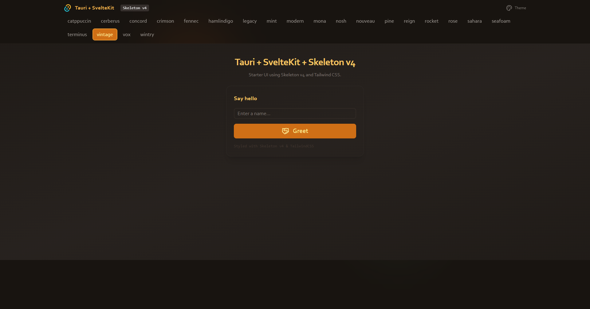

# FocusBoard (Tauri + SvelteKit + Skeleton v4)

A local-first desktop task manager built with a minimal stack.



## Stack
- Tauri 2
- Svelte 5
- Skeleton v4 (`@skeletonlabs/skeleton` and `@skeletonlabs/skeleton-svelte`)
- Tailwind CSS v4 (via `@tailwindcss/vite`)
- Vite 7
- `@tauri-apps/plugin-store` for local persistence
- `tauri-plugin-window-state` for window size/position restore
- Zod for task form validation
- Bun

## Features
- Create tasks with title, notes, and optional due date
- Mark complete/incomplete, delete tasks, and clear completed tasks
- Filter by all, active, and completed
- Persist tasks and app preferences locally
- Persist selected theme and window state across restarts

## Getting Started

Install dependencies:

```bash
bun install
```

Run Tauri in dev:

```bash
bun run tauri dev
```

Build Tauri app:

```bash
bun run tauri build
```
